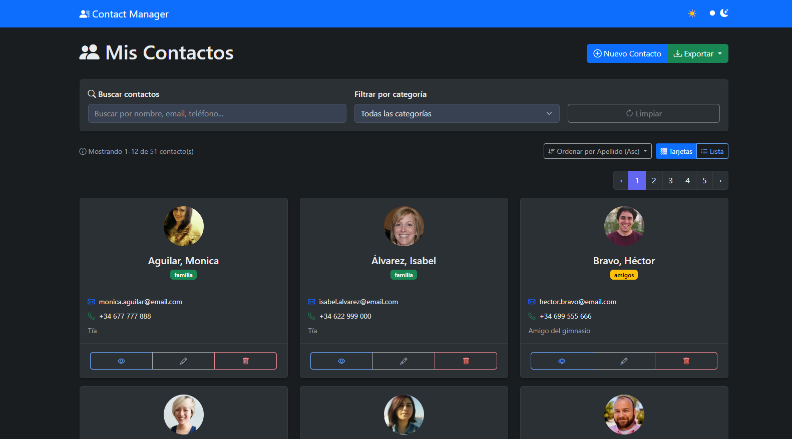
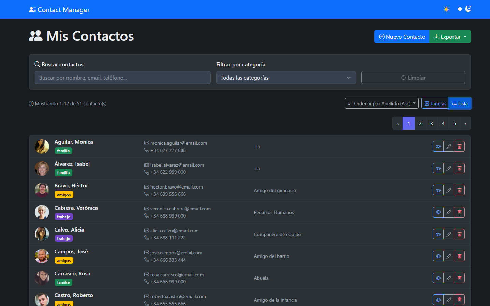
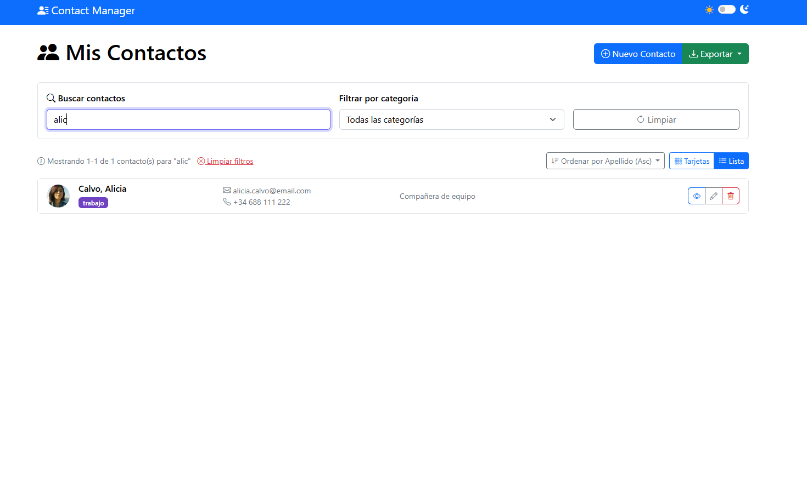
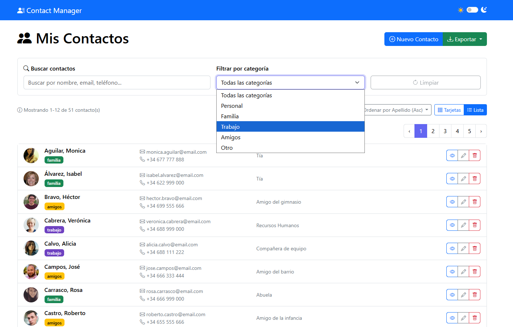
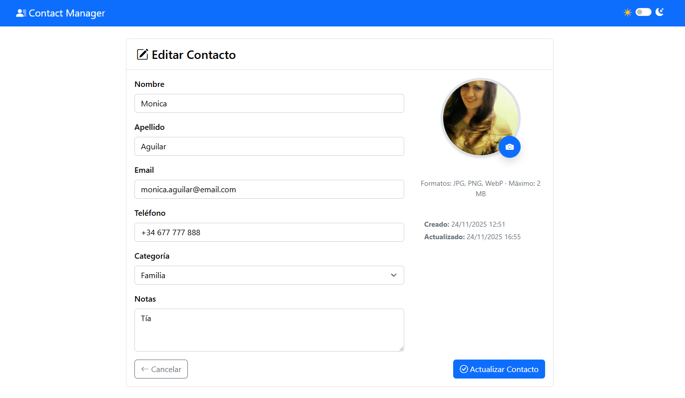
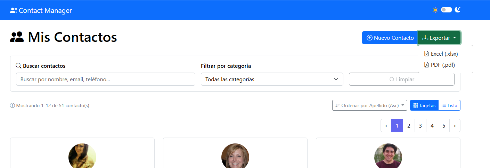

# Contact Manager - Laravel
Sistema de gestión de contactos desarrollado con Laravel, Docker y Bootstrap.

## 🔗 Integración

Esta aplicación está diseñada para funcionar en el subdirectorio `/contactos/` como parte del ecosistema de aplicaciones.

**URL de producción**: `https://ryzenpc.mooo.com/contactos/`


## 🚀 Características

- 🔄 **CRUD completo** - Crear, leer, actualizar y eliminar contactos
- 🔍 **Búsqueda en tiempo real** - Filtrado instantáneo con Livewire  
- 📤 **Exportación filtrada** - Excel y PDF con los resultados de búsqueda
- 📂 **Categorización** - Organiza contactos por tipo (Personal, Familia, Trabajo, etc.)
- 🖼️ **Subida de avatares reales** - Con vista previa, borrado automático y almacenamiento correcto. Fallback automático a iniciales SVG (DiceBear).
- 🎨 **Interfaz responsive** - Diseño adaptable con Bootstrap 5
- 🌙 **Tema claro/oscuro** - Switch persistente entre modos
- 🔢 **Paginación inteligente** - Navegación superior con preservación de filtros
- ⬆️ **Ordenación múltiple** - Por nombre, email, teléfono, categoría y fecha
- 🐳 **Dockerizado al 100%** - PHP + Nginx + MySQL listos para producción
- ✅ **Validación de formularios** - Validación client-side y server-side
- 💾 **Base de datos MySQL** - Almacenamiento robusto de contactos
- 🔗 **Storage enlazado** - `php artisan storage:link` hecho y funcionando

## 🛠️ Stack Tecnológico

- **Backend:** Laravel 10 + PHP 8.2
- **Frontend:** Bootstrap 5 + Blade Templates + Livewire 3
- **Base de datos:** MySQL 8
- **Contenedores:** Docker + Docker Compose
- **Servidor:** Nginx

## 🔄 Equivalencias Tecnológicas

| Componente Laravel | Equivalente React/Node | Equivalente Angular | Equivalente Java Spring |  
|-------------------|------------------------|---------------------|-------------------------|  
| **Laravel (PHP)** | Node.js + Express | Angular | Spring Boot |  
| **Artisan CLI** | npm scripts / NestJS CLI | Angular CLI | Spring Boot CLI / Maven |  
| **Blade Templates** | React Components | Angular Templates | Thymeleaf / JSP |  
| **Eloquent ORM** | Mongoose / Prisma | Services + HttpClient | JPA / Hibernate |  
| **MySQL** | MongoDB / PostgreSQL | MongoDB / PostgreSQL | PostgreSQL |  
| **Bootstrap** | Tailwind CSS / MUI | Angular Material | Thymeleaf + Bootstrap |  
| **Docker** | Docker | Docker | Docker |  


## 📦 Instalación

1. Clonar el repositorio:
```bash
git clone https://github.com/bbvedf/contact-manager-laravel.git
cd contact-manager-laravel`
```

2. Iniciar contenedores Docker:
docker-compose up -d --build

3. Acceder a la aplicación:
http://localhost:8085


## 🐛 Desarrollo
Ejecutar comandos Artisan:

```bash
docker-compose exec app php artisan [command]
```

Acceder a la base de datos:
```bash
docker-compose exec db mysql -u laraveluser -p contact_manager
```

## 📁 Estructura del Proyecto
contact-manager-laravel/  
├── docker-compose.yml  
├── nginx/  
├── mysql/  
├── php/  
├── src/                 # Código Laravel  
└── README.md  

## 📝 Licencia
MIT

## 📸 Capturas de pantalla
|                                    |                                    |                                    |
|:----------------------------------:|:----------------------------------:|:----------------------------------:|
| **Tarjetas – Modo oscuro**<br> | **Lista – Modo oscuro**<br> | **Búsqueda y filtros**<br> |
| **Categorías**<br> | **Edición con avatar**<br> | **Exportar a Excel/PDF**<br> |
